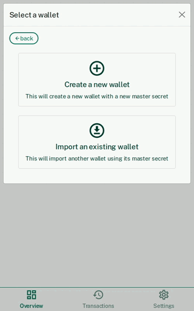

# Mellis: Themelio's official GUI wallet

([Beginner-friendly animated tutorial here!](https://github.com/themeliolabs/mellis/wiki/Installing-Mellis-and-getting-free-MEL))

## How to install?

Go to the [Releases](https://github.com/themeliolabs/mellis/releases) page to download the latest version. Currently, only the following platforms are supported:

- Windows (the `.exe` file)
- macOS (the `.dmg` file)
- Linux (Flatpak; the `.flatpak` file)

Once you're installed head over to our [Discord](https://discord.gg/kNeBHn2B) to **participate in our giveaways**, so that you have something to put in your wallet!

## Run flatpak on Linux

If you have an old version of mellis installed, run:

```bash
flatpak uninstall Wallet
```

Assuming you have installed the latest flatpak from the releases on this GitHub repo, and you have [flatpak](https://flatpak.org/).

```bash
flatpak install mellis.flatpak
flatpak run org.themelio.Wallet
```

## Initial startup

When you first open Mellis you'll be presented a screen to either create a new wallet, or import a secret key

For now, let's create a new wallet and call it `test-wallet3`.



Now that we have this new wallet, we need some assets to fill it.

## Receiving assets

First let's copy our wallet address. To do that, click the receive button and then click `copy`.


You can now paste it a message to your MEL-rich friend and hope they give you some, or you can hop over to our [discord](https://discord.gg/kNeBHn2B) where we're happy to give MEL to our beta-testers.

## Sending assets

Once you find yourself overflowing with MEL you might want to send it out. To do that click the send button, input the recipients address and the amount you want to send, then confirm this transaction in the next popup. Be aware that there are small transaction fees so the amount sent will be slightly more than what you input.


Once you've confirmed the transaction, wait between 30 seconds and 1 minute and your recipient should automatically see those coins in their wallet.

## Viewing transactions

If you'd like to see all transactions coming in and out of your wallet, click the transactions tab. You can find it in the middle of the navigation bar on the bottom of the app window. Notice that pending transactions appear with a progress spinner.


Tapping a fully confirmed transaction will result in a popup containing more information, and it will even include a link to our block explorer, [Melscan](https://scan.themelio.org)

## Switching wallets

Switching wallets is really simple. Just click the wallet name in the drop down at the top of the app window.

From here you will see all available wallets, and you have the option to create a new wallet as well

<!--
## Tapping the Faucet

If you have a wallet on the test network, you have the ability to do what we call "tapping the faucet". That means you are allowed to print money! But don't get too excited. Because you can print a trillion `MEL` for free, it has no real monetary value. Still it's a great way to experiment with the network-->

## Settings

Right now there isn't much to do in the settings page. However, if you're interested you can access this page clicking the far right tab in the on screen navigation. Let us know if you can think of any features to add!


## Creating New Releases
Read [here](Creating_New_Releases.md)


## Follow us

You can find us on [Discord](https://discord.gg/kNeBHn2B), where you meet the community, report wallet bugs, and participate in airdrops!
